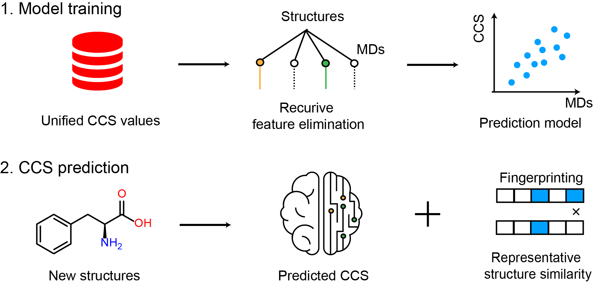

<!-- README.md is generated from README.Rmd. Please edit that file -->

# AllCCS 

## About

`AllCCS` is a R packge which is used for collision cross section value prediction using machine learning approach.



## Web server

[**AllCCS web server**](http://allccs.zhulab.cn/) provides complete functions (Database, Prediction, Identification). Welcome to visit.

## Installation

You can install `AllCCS` from [Github](https://github.com/ZhuMetLab/AllCCS).

```
# Install `AllCCS` from GitHub
if(!require(devtools)){
install.packages("devtools")
}
devtools::install_github("ZhuMetLab/AllCCS")
```
## Usage

Please see the `Get started` page to get the instruction of `AllCCS`.

## Need help?

If you have any quesitions about `AllCCS`, please don't hesitate to email me (zhouzw@sioc.ac.cn). 

## Citation
This free open-source software implements academic research by the authors and co-workers. If you use it,
please support the project by citing the appropriate journal articles.

Z. Zhou, M. Luo, X. Chen, Y. Yin, X. Xiong, R. Wang, and Z.-J. Zhu*, Ion Mobility Collision Cross-Section Atlas for Known and Unknown Metabolite Annotation in Untargeted Metabolomics, ***Nature Communications***, **2020**, 11: 4334. [link](https://www.nature.com/articles/s41467-020-18171-8)

## License
<a rel="license" href="https://creativecommons.org/licenses/by-nc-nd/4.0/"></a> 
This work is licensed under the Attribution-NonCommercial-NoDerivatives 4.0 International (CC BY-NC-ND 4.0)
